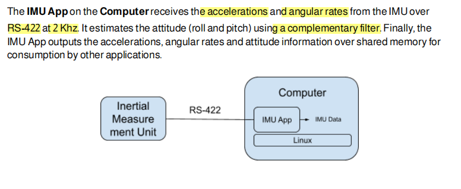
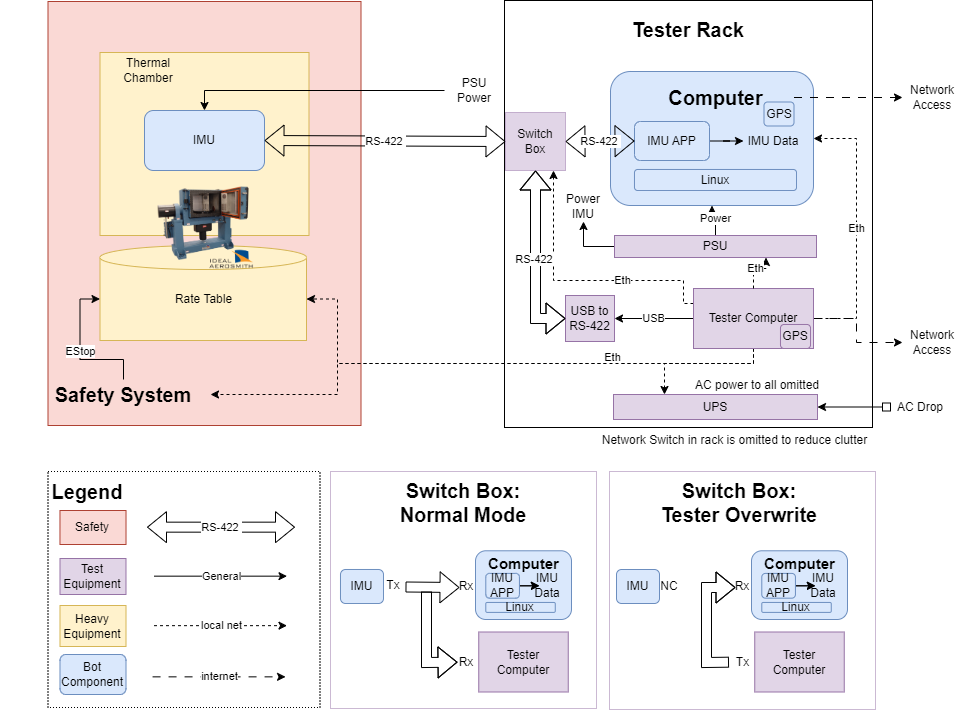
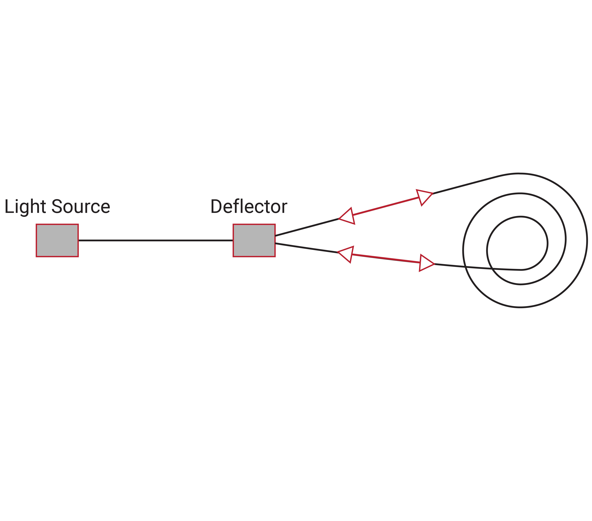
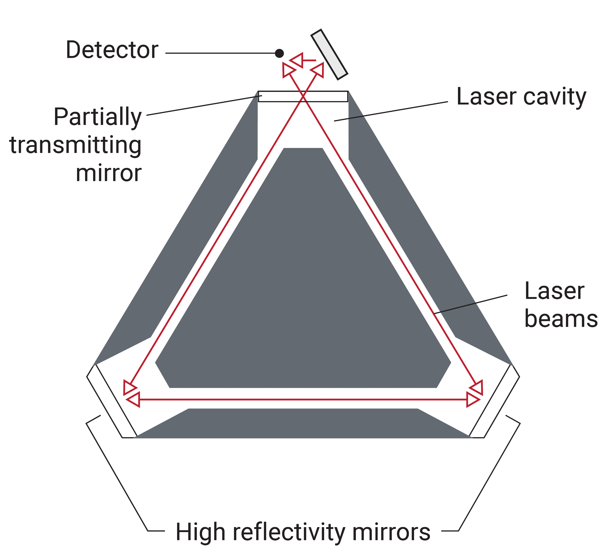
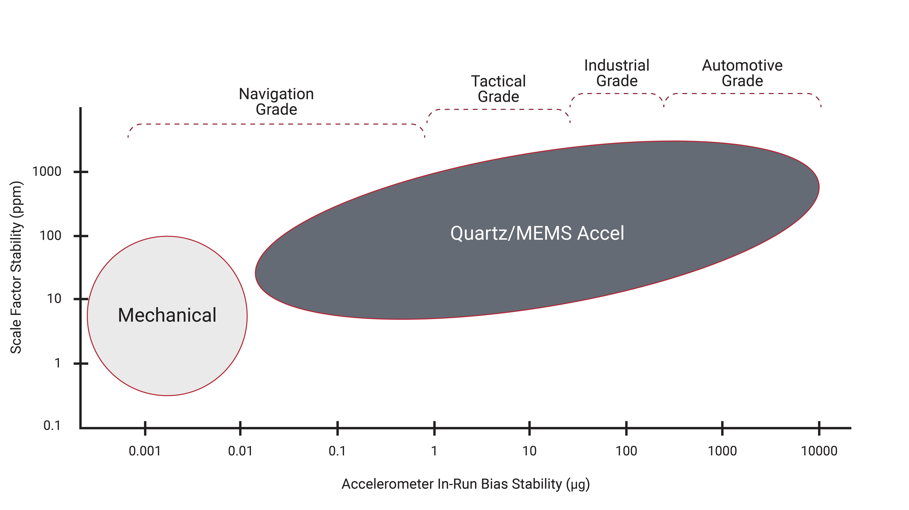
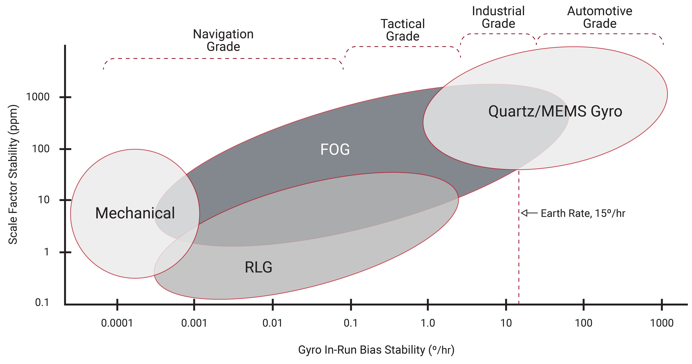
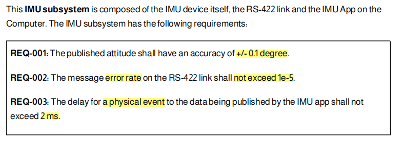
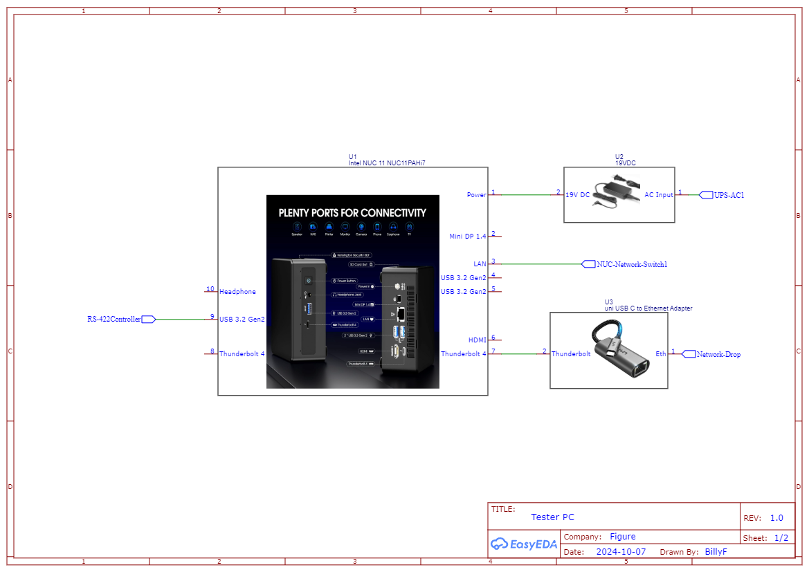
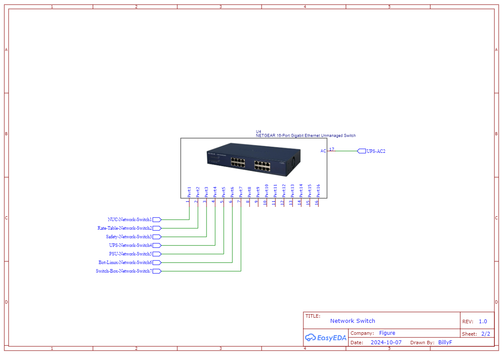
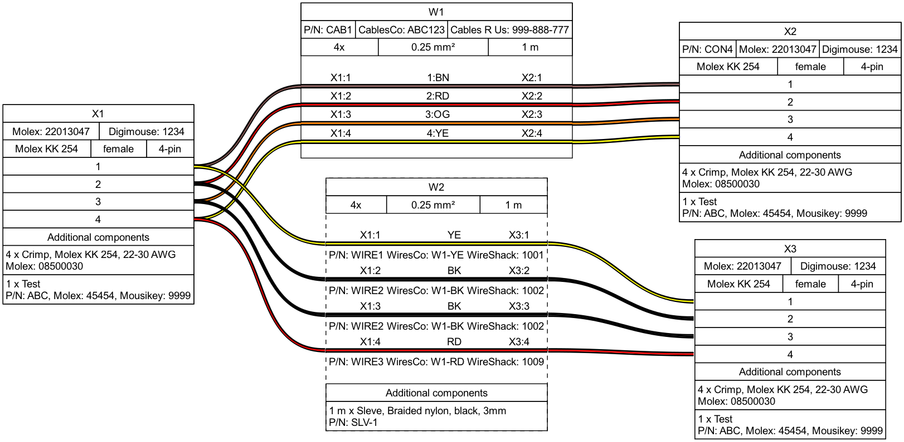

# Figure IMU Subsystem Automation Test Design Doc

<div style="display: flex;">
  <div style="flex: 50%; padding: 10px;">
    <h3>Overview</h3>
    <p> This case study focuses on automating the testing of an Inertial Measurement Unit (IMU)
    subsystem. The IMU system sends accelerations and angular rates to an application for attitude
    estimation. Key tasks include designing a test setup, preparing documentation for technicians,
    and implementing a Python test case.
    </p>
    <br>

    *** This is a mock documentation, presented in the mannar
    I would normally have in a working doc to point internal
    teams to.

   </div>
  <div style="flex: 50%; padding: 10px;">
    <h3>Point of Contacts</h3>
    <b>Electircal Eng:</b> xxx<br>
    <b>Firmware Eng:</b> xxx<br>
    <b>QA Eng:</b> xxx<br>
    <b>System Integration Eng:</b> xxx<br>
    <b>Tech :</b> xxx<br>
    <b>Test Automation Eng:</b> Bill Fang <br>
    <h3>Pretend to be Useful Links</h3>
    <span style="color: blue; text-decoration: underline;">Altium Project Link</span><br>
    <span style="color: blue; text-decoration: underline;">Repo Link</span><br>
    <span style="color: blue; text-decoration: underline;">System Requirement Link</span><br>
  </div>
</div>

## Table of Contents
TODO: rege before final release

- [Figure IMU Subsystem Automation Test Design Doc](#figure-imu-subsystem-automation-test-design-doc)
  - [Table of Contents](#table-of-contents)
  - [System Block Diagram](#system-block-diagram)
    - [IMU System](#imu-system)
    - [Test Setup](#test-setup)
  - [Assumptions](#assumptions)
  - [Design Considerations](#design-considerations)
  - [System Analysis](#system-analysis)
    - [IMU properties](#imu-properties)
      - [Types of IMUs and limitations](#types-of-imus-and-limitations)
      - [Accelerometer Performance Grades](#accelerometer-performance-grades)
      - [Gyroscope Performance Grades](#gyroscope-performance-grades)
      - [IMU design considerations](#imu-design-considerations)
    - [RS-422 Spec](#rs-422-spec)
  - [Test Covorage](#test-covorage)
    - [REQ-001 Attitude Accuracy](#req-001-attitude-accuracy)
      - [TEST-001 IMU full range accuracy sweep](#test-001-imu-full-range-accuracy-sweep)
      - [TEST-002 IMU temperature compensation check](#test-002-imu-temperature-compensation-check)
      - [TEST-003 IMU drift test](#test-003-imu-drift-test)
      - [TEST-004 IMU vibe check](#test-004-imu-vibe-check)
    - [REQ-002 RS-422 Error Rate](#req-002-rs-422-error-rate)
      - [TEST-005 RS-422 Error Rate Test](#test-005-rs-422-error-rate-test)
    - [REQ-003 2ms Delay limit](#req-003-2ms-delay-limit)
      - [TEST-006 IMU delay test](#test-006-imu-delay-test)
    - [Other Considerations](#other-considerations)
  - [Tester Build Docs](#tester-build-docs)
    - [Block Diagram](#block-diagram)
    - [Schematics](#schematics)
    - [BOM](#bom)
    - [Check List](#check-list)
    - [Equipment Manual](#equipment-manual)
    - [Harness Diagram](#harness-diagram)
      - [Cable 007](#cable-007)
    - [Provision Instructions](#provision-instructions)
      - [Check Network Settings](#check-network-settings)
  - [Test Case Implementation](#test-case-implementation)
  - [Team, Processes, and Tools](#team-processes-and-tools)
    - [Team](#team)
    - [Processes and Tools](#processes-and-tools)


## System Block Diagram

### IMU System

### Test Setup
The test setup utilizes a rate table with thermal chamber build as the main piece of equipment to provide precise control of the IMU position. A safety system (robot cell) is put in place to ensure the safety of turn table operation. A small tester rack is used to host other additional parts.



For more detail [Link to build doc](#tester-build-docs)


## Assumptions

Assumptions are important, below listed the top level assumptions of the whole system. Specific
assumptions will show up as notes within their context for easy reference.


!!! tip Assumptions
    **Assumption-1** The IMU System hardware has been designed to meet the requirement with reasonable
    design margins and the hardware has been validated for basic operations.
    **Assumption-2** The IMU is a stand alone in house control unit with its own MCU and it implements
    standrad protocols on top of the RS-422 interface. The IMU firmware is also regression target.
    **Assumption-3** The IMU is a Silicon MEMS type IMU in this applicaiton without magnetometer. Otherwise
    further environment control measures are needed.
    **Assumption-4** The IMU has on board temperature sense and well defined calibration routines.
    **Assumption-5** DUT and test set up has been checked for worksmanship and build to print.
    **Assumption-6** Testing covers a Industrial operating temperatures range of -40&#176;C to +85&#176;C.
    **Assumption-7** Test system design proritize preformance and accuracy with reasonable cost.
    **Assumption-8** System Computer running linux-RT the IMU app is allocated adquate resources and priority.
    **Assumption-9** This case study focus on automation test for firmware regressions. Automations tests
    can also be done for hardware validatoin, reliability, and manufacturing with different focus. Those
    test usage and set up are not considered.

!!! note
    When a lower cost solution is desired. In case it is not obvious. The test set up is designed to have
    really clean connections between the lift side (Heavy equipment) and the right side (tester rack).
    In the case of we don't need as much of IMU hardware involvement. The IMU app can be tested with
    simulated IMU data, and still run on real linux hardward.


## Design Considerations

## System Analysis

What do I know about the system and its limitations.

### IMU properties
An Inertial Measurement Unit (IMU) typically consists of three key components:

1. **Accelerometers**: Measure linear acceleration along the x, y, and z axes.
2. **Gyroscopes**: Measure angular velocity or rotational rate around the same axes.
3. **Magnetometers** (optional in some IMUs): Measure the magnetic field, providing orientation relative to Earth's magnetic field for better heading determination.

These components work together to provide information on motion, orientation, and velocity in space.

#### Types of IMUs and limitations
IMUs come in several types, each with different strengths:

1. **Silicon MEMS IMUs**: Small, cost-effective, used in consumer electronics and industrial applications. Offer lower accuracy but are compact.
2. **Fiber Optic Gyro (FOG) IMUs**: Provide high accuracy with no moving parts, ideal for navigation systems in aerospace.
3. **Ring Laser Gyro (RLG) IMUs**: Highly precise, used in high-end aerospace and defense applications.
4. **Quartz MEMS IMUs**: Known for stability and low drift, used in industrial and tactical applications.

More details can be found [here](https://www.jouav.com/blog/inertial-measurement-unit.html).

<p float="left">
  
  
</p>

image source: [inertial-navigation-primer-r3](Reference/inertial-navigation-primer-r3.pdf)
#### Accelerometer Performance Grades

#### Gyroscope Performance Grades


#### IMU design considerations
To achieve high IMU Accuracy  the following factors need to be considered during design and validtions.

1. **Zero-Bias Temperature Hysteresis**: IMU output can deviate due to temperature changes. Using temperature compensation algorithms and choosing brands with precise compensation technology ensures reliability.
2. **Vibration Characteristics**: IMUs should handle vibrations with features like vibration isolation and filtering to maintain accuracy.
3. **Repeated Power-On Deviation**: Bias may vary after power cycles, impacting calibration. IMUs with minimal deviation or built-in compensation ensure long-term stability.
4. **External Forces**: Shock-resistant designs reduce deviations under external forces.
5. **Nonlinear Factor**: Lower %Fs ensures better measurement accuracy across the range.

**Calibrations**
Calibrating an IMU involves placing it on a stable surface for static calibration, then using manufacturer-provided software to guide through the process. Dynamic calibration follows, where the IMU is moved along different axes to adjust for sensor biases. If a magnetometer is included, rotate the IMU fully to capture magnetic field data, avoiding interference. Finally, verify accuracy by comparing outputs to expected values, and re-calibrate periodically to maintain performance.

### RS-422 Spec


| Start Bit |   Data Bits (8 bits)    | Parity Bit | Stop Bit(s) |
| :-------: | :---------------------: | :--------: | :---------: |
|     0     | D0 D1 D2 D3 D4 D5 D6 D7 |     P      |      1      |

---

## Test Covorage



!!! note
    **Test Things Where Most Effective:** There are various ways we could test this subsystem. It
    could be a full simulated enviroment with each component been moduled in a Software in the loop(SIL)
    test, or we could instrument and modify the IMU to inject ditial signals that replaces sensor IC
    signals to avoid use of heavy equipment and improve fault injection ability. Or a system similar
    to the proposed setup could be achieved at lower cost with less capabilities. And in real world,
    we are likely to have each favor of the test infra and setup. Ideally we have all coverage on all
    setup. In practice, we choose the most effective combination of set up that can provide sufficient
    coverage given the time and resources in hand.


!!! tip Assumptions
    **Assumption-** Related test infrastures has been set up for result upload and store. This will
    happen at test tear down which is omitted in the procedures below.

### REQ-001 Attitude Accuracy
#### TEST-001 IMU full range accuracy sweep
This test checks for IMU's accuracy with small changes and impluse changes.

<u>Test Procedure:</u>
1. Zero IMU location, RS-422 link to direct connection.
2. Parameterized test sweeping each axis with 1 degree steps.
3. Assert for each step the reported meansure is within +/- 0.1 degree of the set position.
4. Parameterized test sweeping each axis with 180 degree steps.
5. Assert for each step the reported meansure is within +/- 0.1 degree of the set position.

!!! tip Assumptions
    **Assumption-** The rate table is calibrated, it's set position is true position.

#### TEST-002 IMU temperature compensation check
This test check for IMU's temperature compenstaion algorigthm implementation.

<u>Test Procedure:</u>
1. Parameterized test sweeping temperature from  -40&#176;C to +85&#176;C with 5&#176;C steps.
2. Run TEST-001

!!! tip Assumptions
    **Assumption-** Tester has enough bandwidth for running test. In real life, re

#### TEST-003 IMU drift test
!!! tip Assumptions
    **Assumption-** Assume IMU has data processing and correction algorithms implemented to prevent drifting.
This test check for IMU's coorection algorithms. This is a run on idel test that run opportunistically when
no other job is available.

<u>Test Procedure:</u>
1. Zero IMU location, set test chamber to room temp, RS-422 link to direct connection.
2. Assert inital value is within expected zero location range +/- 0.1 degree.
3. Record inital value and start a timer.
4. Assert on every data recieved is within drift rate bound until terminated by governor.
5. On teardown check upload drift rate measured in this test period in addition to results for data trend.

!!! tip Assumptions
    **Assumption-** Assume we have a test job govorner running. We can notify job to end if we sees
    other jobs come in.

#### TEST-004 IMU vibe check
~~This test check if IMU brings good vibe for the robot :sunglasses:~~
External factors like vibrations can affect IMU reading. And withing the robot there are some inheritent vibrations resulting from motor control and opearations. This test check for IMU system's ability to filter and offeset the linear accelaration's affect on angular infomation. Check for motor control pwm requency or load switching freqency from the near by subsystems that is within the sensor's bandwidth.

<u>Test Procedure:</u>
1. Zero IMU location, set test chamber to room temp, RS-422 link to direct connection.
2. Parameterized test with critical frequencies.
3. Set vibration shaker to each frequency and measure assert reported attitude data within accuracy.

!!! caution Check
    Comfirm with hardward team, this likely can be a hardware characterization test instead of a
    regression item until further lessons learned.


### REQ-002 RS-422 Error Rate
#### TEST-005 RS-422 Error Rate Test
!!! tip Assumptions
    **Assumption-** The robot harness has been designed properly and tested with reprentative
    switching laod that would run parallel to the RS-422 link in the robot. This test can also
    be used for the characterization.
This test mainly targeting the IMU APP's ability to detect and report error rate correctly as a
regression test. The goal is to ensure the error rate stat is accurate.

<u>Test Procedure:</u>
1. Zero IMU location, set test chamber to room temp.
2. Switch RS-422 link to fault injections mod connecting:
    `tester PC RS-422 out` <-> `RS-422 link` <-> `IMU APP computer`
3. Norminal Case send over 2e^5 messages, check total error reported <= 2
4. Fault Case send over 2e^5 messages, with 6 error message check total error reported <= (2+6)

### REQ-003 2ms Delay limit
#### TEST-006 IMU delay test


!!! tip Assumptions
    **Assumption-** The time taken for the host PC to send a command and receive a response from the rate table is known and well-defined.
    **Assumption-** The IMU Linux computer and the tester PC has access to GPS receiver for GPS Clock sync.

This test verifies that the latency between a physical event and the data published by the IMUApp is within the specified 2 ms limit. The test uses GPS Clock to synchronize the clocks of the test systems, ensuring that accurate event timing is maintained.

<u>Test Procedure:</u>

1. Zero IMU location, set test chamber to room temp, RS-422 link to direct connection.
2. Ensure that both the tester computer and the IMUApp computer synchronize their clocks using GPS Clock.
3. Trigger a physical event and record time stemp.
4. Repeat for all axis directions.
5. Process time stemp assert all latency is less than 2ms.

!!! info
    GPS time sync accuracy is highly precise, with the ability to synchronize clocks and networks to Coordinated Universal Time (UTC) with an accuracy of 30 nanoseconds or less 95% of the time.
    **Atomic clocks**
    GPS satellites contain atomic clocks that keep time to within three nanoseconds.
    **GPS receivers**
    GPS receivers decode the signals from the satellites to synchronize themselves to the atomic clocks

    Time card option example:
    
    

!!! note
    **Alternatives considered:**
    + `Network Time Protocol (NTP)`: NTP can synchronize time across devices that differ by milliseconds to tens of milliseconds, even over wide-area networks (WANs) like the internet.
    + `Trigger Output`: The signal generator should output a trigger signal simultaneously with the physical event. This signal can act as a reference point for when the event occurs.
    + `Oscilloscope or Logic Analyzer`: Use a scope or logic analyzer to capture signal coming out of IMU and a triger from linux computer when data is posted.


### Other Considerations
!!! note
    Other test / logging that could be considered:
    - CPU usage stats of the IMU app
    - Test equipment health check
    - Measure key value delta from average value from pervious mainline releases
    - Log run time for maintaince reminder

---
## Tester Build Docs
This is the build doc for the IMU subsystem automation test.
**POC**: Bill Fang
**Needed by**: `Nov 15, 2024`
**Budget Cost** : SPEND123
**Job Categories**: `heavy equipment land` `mechinical build` `harness build` `small rack build`
### Block Diagram

### Schematics
[IMU_Tester_Schematics](Tester_Schematics/Schematic_IMU_Tester_2024-10-07.pdf)



### BOM
[IMU_Tester_BOM](Tester_Schematics/BOM_IMU_Tester_2024-10-07.csv)

### Check List
- [x] Schematics Walk Through
- [ ] BOM procement
- [ ] Space allocation
- [ ] Facility Drop Requirement
- [ ] Internal parts procement
- [ ] Harness build
- [ ] PC provision
- [ ] Rack build
- [ ] ......
### Equipment Manual
### Harness Diagram
#### Cable 007

 [source_file](Harness_docs/Cable007/Cable007.yml) and  [Bill of Material](Harness_docs/Cable007/Cable007.bom.tsv)

!!! warning
    Watch out for null model cable for RS-422. Please label cable type null modem or not.


### Provision Instructions

#### Check Network Settings
<details>
  <summary>For host config setting: Click to expand</summary>
Add host to `~/.ssh/config`

```bash
Host imu-tester-1
    HostName imu-tester-1
    User sa-auto
    IdentityFile ~/.ssh/id_rsa_sa_auto

```
</details>

Config Tester PC network ip
```bash
# remote into tester host
ssh imu-tester-1

# check ip config
ifconfig

eth0      Link encap:Ethernet  HWaddr 00:1A:2B:3C:4D:5E
          inet addr:192.168.1.10  Bcast:192.168.1.255  Mask:255.255.255.0
          inet6 addr: fe80::21a:2bff:fe3c:4d5e/64 Scope:Link
          UP BROADCAST RUNNING MULTICAST  MTU:1500  Metric:1
          RX packets:1234567 errors:0 dropped:0 overruns:0 frame:0
          TX packets:7654321 errors:0 dropped:0 overruns:0 carrier:0
          collisions:0 txqueuelen:1000
          RX bytes:987654321 (987.6 MB)  TX bytes:1234567890 (1.2 GB)
          Interrupt:20 Memory:fb000000-fb020000

lo        Link encap:Local Loopback
          inet addr:127.0.0.1  Mask:255.0.0.0
          inet6 addr: ::1/128 Scope:Host
          UP LOOPBACK RUNNING  MTU:65536  Metric:1
          RX packets:9876 errors:0 dropped:0 overruns:0 frame:0
          TX packets:9876 errors:0 dropped:0 overruns:0 carrier:0
          collisions:0 txqueuelen:0
          RX bytes:654321 (654.3 KB)  TX bytes:654321 (654.3 KB)

# confirm eth0 addr is set to 192.168.1.10

exit
```


---
## Test Case Implementation
Here’s a Python implementation of TEST-006: IMU Delay Test using pytest and assuming an ideal test framework with an API that interacts with the IMU and tester computers.

!!! tip Assumptions
    **Assumption-** Proper flashing sequence exists in infra and already been done before test run.

```python
# imu_delay_test.py
import pytest
import time
import threading
import logging
from logging.handlers import RotatingFileHandler
from datetime import datetime
from enum import Enum, auto

# Assuming an ideal API for test framework
from imu_test_framework import IMU, Tester, ResultUploader, LinuxComputer

# Constants
MAX_LATENCY_MS = 2.0             # Maximum allowed latency in milliseconds
LOG_INTERVAL_MS = 0.5            # Interval in seconds for logging trace data (0.5ms for 2kHz report rate)
LOG_FILE_SIZE = 5 * 1024 * 1024  # 5MB maximum size for each log file
BACKUP_COUNT = 3                 # Keep 3 backup log files
ROOM_TEMP_C = 26.0               # Room temp 26C
EVENT_REACTION_TIME_MS = 0.045   # The Reaction time from a command to physical event

class 422LinkType(Enum):
    NORMAL = auto()
    TESTEROVERWRITE = auto()

# Configure the logger at the module level
logger = logging.getLogger(__name__)
logger.setLevel(logging.INFO)

# Setup log rotation handler
file_handler = RotatingFileHandler(
    "imu_trace_log.log", maxBytes=LOG_FILE_SIZE, backupCount=BACKUP_COUNT
)
formatter = logging.Formatter(
    "%(asctime)s - %(threadName)s - %(levelname)s - %(message)s"
)
file_handler.setFormatter(formatter)

# Stream handler for console logging
console_handler = logging.StreamHandler()
console_handler.setFormatter(formatter)

# Add both handlers to the logger
logger.addHandler(file_handler)
logger.addHandler(console_handler)

def trace_logger(imu, linux_computer, stop_event):
    """
    Thread function to log data from both IMU and the Linux computer.

    :param imu: IMU object from which to fetch data.
    :param linux_computer: Linux computer object to fetch IMU subsystem data.
    :param stop_event: Event to signal the thread to stop logging.
    """
    while not stop_event.is_set():
        # Fetch and log IMU data
        imu_data = imu.get_data()
        logger.info(f"IMU Data: {imu_data}")

        # Fetch and log Linux computer system data
        linux_data = linux_computer.get_system_stats()
        logger.info(f"Linux IMU Subsystem Data: {linux_data}")

        # Wait for the next logging interval (0.5 ms for 2kHz reporting)
        # TODO: @zhengsfang time.sleep is not accurate, test and upsample if needed
        time.sleep(LOG_INTERVAL_MS)

@pytest.fixture(scope="module")
def setup_imu_and_tester():
    """
    Fixture to initialize the IMU and tester computers, perform calibration, time synchronization,
    and manage trace logging. Returns IMU, tester, and logging control.
    """
    imu = IMU()                       # Test PC's RS-422 connection to IMU
    tester = Tester()                 # All tester equipment controls
    linux_computer = LinuxComputer()  # Controls to subsystem app Linux Computer

    # Step 1: Zero IMU location, set test chamber to room temp, RS-422 link to direct connection.
    tester.rate_table_zero()
    tester.set_temp(ROOM_TEMP_C)
    tester.set_422_link(422LinkType.NORMAL)

    # Step 2: Perform time synchronization using GPS Clock
    linux_computer.gps_sync()
    tester.gps_sync()

    # Start trace logging thread
    stop_event = threading.Event()
    logging_thread = threading.Thread(
        target=trace_logger,
        args=(imu, linux_computer, stop_event),
        name="TraceLoggerThread",
        daemon=True
    )
    logging_thread.start()

    # Yield IMU, tester, linux_computer, and stop_event to the tests
    yield imu, tester, linux_computer, stop_event

    # Stop the logging thread
    stop_event.set()
    logging_thread.join()

    # Upload results and statistics after the tests are complete
    uploader = ResultUploader()
    uploader.upload_stats(imu.get_stats())
    uploader.upload_results(tester.aggregate_results())

@pytest.mark.parametrize("axis", ["x", "y", "z"])
@pytest.mark.parametrize("turn_degrees", ["1", "60", "180"])
def test_imu_delay(axis, turn_degrees, setup_imu_and_tester):
    """
    Test that the IMUApp responds to physical events on all axes (X, Y, Z) and across different
    event sizes (small, medium, large) with a latency of less than 2 ms.

    :param axis: The axis (x, y, z) for which to trigger the event.
    :param turn_degrees: The size of the event "1", "60", "180" (small, medium, large), simulating
     different physical conditions.
    :param setup_imu_and_tester: Fixture to set up the IMU, tester, and logging thread.
    """
    imu, tester, linux_computer, stop_event = setup_imu_and_tester

    # Step 3-4: Trigger a physical event of the given size on the specified axis
    event_time = tester.set_rate_table(axis=axis, degree=turn_degrees)

    # Record the exact time of the physical event (this will be T_event)
    event_timestamp = time.perf_counter()

    # Capture the IMU System's response data timestamp
    imu_data = linux_computer.get_data()  # Assuming this method fetches the data with timestamp

    # Calculate latency (T_output - T_event)
    latency_ms = (imu_data['timestamp'] - event_timestamp) * 1000 - EVENT_REACTION_TIME_MS

    # Log message for the specific axis and turn
    logger.info(f"IMU latency for {axis} axis, {turn_degrees} degree: {latency_ms:.3f} ms")

    # Step 5: Assert that the latency is below the maximum allowed value
    try:
        assert latency_ms <= MAX_LATENCY_MS, (
            f"Latency too high: {latency_ms:.3f} ms for {axis} axis, {event_size} event"
        )
    except AssertionError as e:
        logger.error(f"Assertion failed: {e}")
        raise


# Test framework API assumptions:
# imu.gps_sync() -> Synchronizes IMU clock with GPS Clock
# tester.gps_sync() -> Synchronizes Tester computer clock with GPS Clock
# tester.set_rate_table(axis, degree) -> Triggers a physical event of specified degree on the given axis and returns the event time
# linux_computer.get_data() -> Returns a dictionary with IMU data and a 'timestamp' key indicating when the data was published
# linux_computer.get_system_stats() -> Returns system statistics from the Linux computer
# imu.get_stats() -> Retrieves statistics gathered during the test
# tester.aggregate_results() -> Retrieves test results and logs for uploading
# ResultUploader.upload_stats(stats) -> Uploads collected test statistics
# ResultUploader.upload_results(results) -> Uploads test results after the test suite completes
```

## Team, Processes, and Tools
### Team
**Electircal Eng:**
+ Talking to EE for board specs and power requirements. Any circuit related deep dive.
+ Request test points for future rev.
+ Share any bug found.
+ Share automations script that can also be leverage for design validation.

**Firmware Eng:**
+ Communicate to fw dev on what is our existing automation tester capability.
+ Reling on fw team to help understand certain system behavoir, debug trace.
+ Request additional data logging or new service routine to be added.
+ Scope automation infra needs for developers to create tests as the develop new fetures.

**QA Eng:**
+ Understand the top offending failure trend.
+ Request new matrix and dashboard.
+ Align on reporting schema that can be used across the board.
+ Add automation test coverages to help faster release sign off.

**System Integration Eng:**
+ Learn about the subsystem bug that escaped to system level and add coverages.
+ Learn about time cosuming operations that can be helped with automation test coverages.
+ Align on coverage distribution, don't step over each other.

**Tech:**
+ Request build help.
+ Document feedback & red line.
+ Learn about commonly stocked/prefered common parts.
+ Learn about how to improve build documents.

**Test Automation Eng:**
+ New infrastruct to that is been added.
+ Learn about other subsystem automation setup and what can be reused.

### Processes and Tools

Having a interactive test requirement tracking process would be helpful for a rapidly moving organization.
As new requirement and assumptions emerge quickly in a start up. An easy to use `test requirement
tracking matirx` tool that could provide low friction for developer to keep it up to date, and also provide a tracking of existing coverage and their state of health would offer great benefit. The team can have the minimum amount of coverage at early stage with quick implimentation and add duplicated coverage when feature matured for more test bandwidth and availability.


A **nice-to-have** leader board for people to put up their common conplaints and desired quality of
life improvement will be a good way to create traction on making feedback or improvoments.

New tool **show and tell** or **technical section deep dive** will be good ways to share lessons learned
and grow the general knowledge on systems.